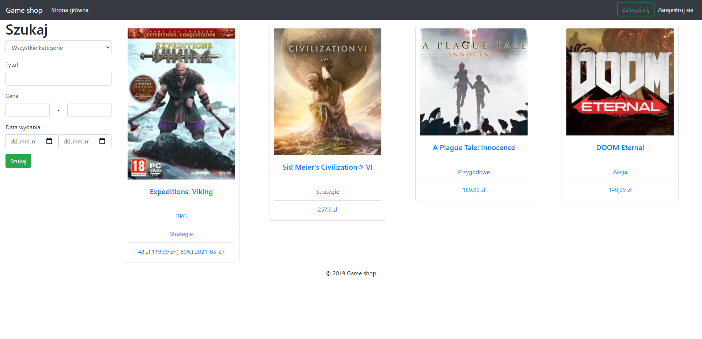
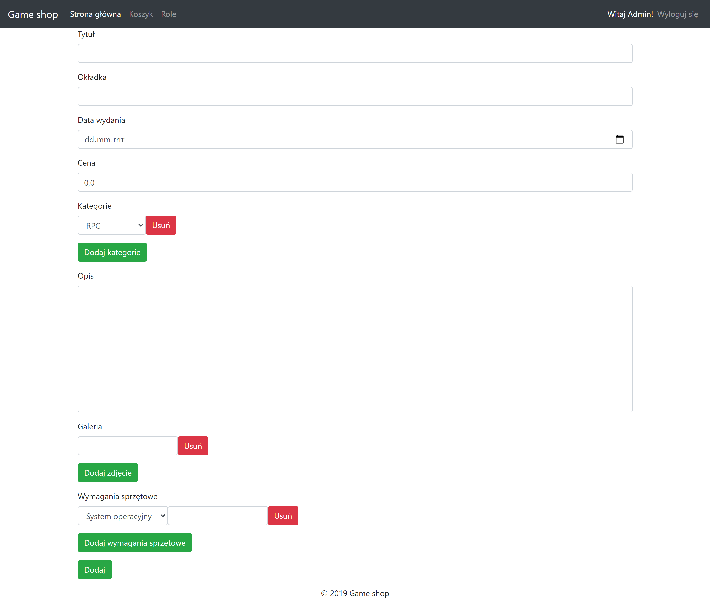

# Game_shop
> Simple game store website created with spring boot, spring security, thymeleaf and MySQL.

## Table of contents
* [Screenshots](#screenshots)
* [Technologies](#technologies)
* [Setup](#setup)
* [Features](#features)
* [To-do](#To-do)

## Screenshots



## Technologies
* Spring-boot - 2.2.3
* Spring-security - 5.2.1
* Spring-data-jpa - 2.2.3
* Spring-boot-test - 2.2.3
* Mockito - 3.1.0
* JUnit - 5.5.2
* Hibernate - 5.4.10
* Thymeleaf - 3.0.11
* Bootstrap - 4.6.0
* JQuery - 3.5.1
* Maven
* MySQL

## Setup
To run this project you need a MySQL server running with the game_shop database. The script for generating the database with sample data can be found [here](https://github.com/GITjest/Game_shop/blob/master/Game_shop.sql).
```
# Clone this repository
git clone https://github.com/GITjest/Game_shop

# Go into the repository
cd game_shop

# Run the app
mvn spring-boot:run
```
URL to access application UI: http://localhost:8080/

## Features
* Multi-criteria search engine
* Adding, editing and removing games
* Adding, editing and removing reviews
* Adding discounts
* Internalization
* Basket
* Assigning a roles to a users(for admins)

## To-do
* correct internalization
